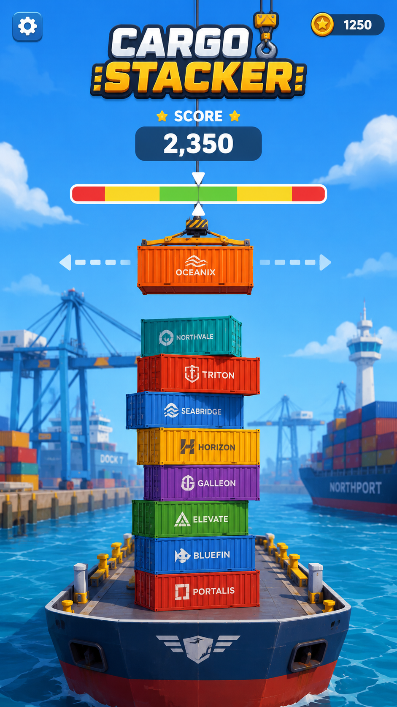

# Cargo Stacker

Cargo Stacker is a browser-first arcade stacking game inspired by the classic Stack format, rebuilt around a cargo ship and shipping-container theme. Containers move across alternating horizontal axes, the player drops each one onto the stack, and any overhanging section is cut away as the tower climbs from the harbor into the sky.



## Current Features

- 3D container stacking with alternating movement planes.
- Ship-and-harbor themed scrolling background.
- Container slicing, falling offcuts, impact effects, and sound effects.
- Persistent record score.
- Settings panel with mute, test mode, reset record, resume, and restart.
- Session-only test mode that reveals a `Test` button for perfect one-container placement.
- Shared web build used by Capacitor Android/iOS and Electron Windows wrappers.

## Controls

- Click or tap the playfield to place the moving container.
- Press `Space` or `Enter` to place a container.
- Press the gear button to open settings.
- Use the bottom-left speaker button to toggle mute.
- Enable Test Mode in settings to show the `Test` button on the main play screen.

## Project Structure

```text
public/themes/cargo/
  backgrounds/       Scrolling sky/harbor backdrop images
  concepts/          Source concept art used for visual reference
  containers/        Normalized container textures and variants
  environment/       Deck/water support assets
  ui/                Logo, settings icon, buttons, and HUD assets
  vfx/               Impact, splash, and perfect placement frames

src/game/            React game shell and Three.js stacking engine
src/theme/           Theme manifest that maps normalized assets into gameplay
electron/            Windows desktop wrapper
android/             Capacitor Android project
ios/                 Capacitor iOS project
```

The theme folder is intentionally normalized so future visual themes can follow the same manifest-driven asset layout instead of rewriting gameplay code.

## Development

```bash
npm install
npm run dev
```

The dev server runs on Vite. The current local test URL is usually:

```text
http://127.0.0.1:5178/
```

## Builds

### Web

```bash
npm run build
```

The production web build is written to `dist/`.

### Android

```bash
npm run android:sync
npm run android:build
```

The debug APK is written to:

```text
android/app/build/outputs/apk/debug/app-debug.apk
```

### iOS

```bash
npm run ios:sync
npm run ios:open
```

The iOS project is generated under `ios/`. Building, signing, and simulator/device testing require macOS with Xcode.

### Windows

```bash
npm run windows:build
```

Windows builds are generated under `release/windows/`. The distributable installer is:

```text
release/windows/Cargo Stacker Setup 0.1.0.exe
```

The unpacked smoke-test executable is:

```text
release/windows/win-unpacked/Cargo Stacker.exe
```

## Notes

- The old portable Windows target was replaced with an NSIS installer because the portable package extracted and ran from `%TEMP%`, which caused the Electron renderer to crash before the app loaded on the test machine.
- Mute is persisted between launches. Test mode is intentionally reset to hidden/off on every fresh page load.
